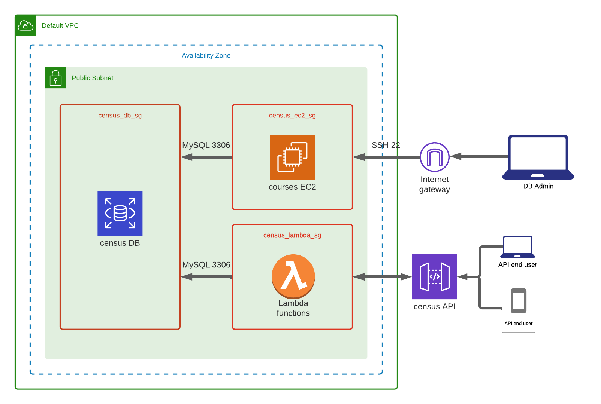

This activity demonstrates the steps to create a simple API based on Python, MySQL, and AWS. 

* create census_ec2_sg, census_lambda_sg, and census_db_sg
* instantiate an RDS MySQL service, having it in census_db_sg
* instantiate an EC2 instance, having it in census_ec2_sg
* ssh to the EC2 instance and connect to MySQL
* create and populate the census database 
* create lambda layer 
* create lambda function
* create census API
* test it!